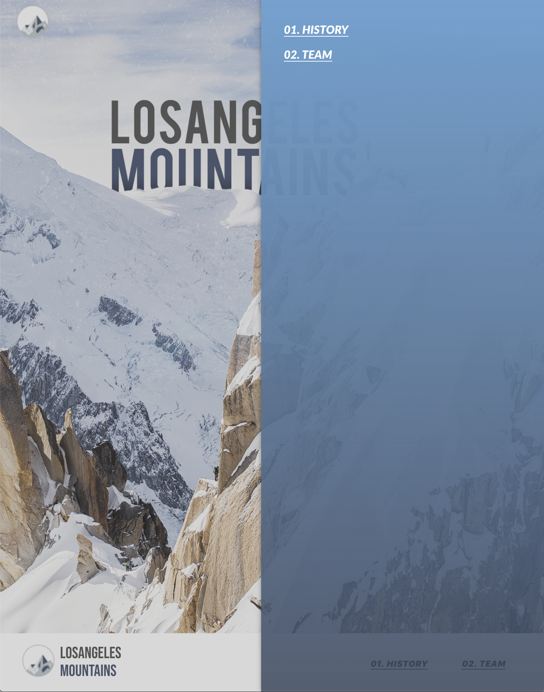

# **LA Mountains Website**

### Click the link to view the website

[LA Mountains template Website](https://mountain-template.web.app/)

### About Us

##### Mock iMessage Frontend UI built utilizing React, Redux, SASS, and more. Deployed to Firebase utilizing Firebase database and user authentication.

#### Project Work:

##### https://github.com/davesheinbein

#### LinkedIn:

##### https://www.linkedin.com/in/david-sheinbein/

## Screenshot:

[Wireframe Sceenshot](https://imgur.com/MHTXVay)

[Landing Page Sceenshot](https://imgur.com/sSTUqNH)

[History Page Sceenshot](https://imgur.com/NfEneRy)

[Climb Page Sceenshot](https://imgur.com/4PHVHVL)

[Responsive Header Page Sceenshot](https://imgur.com/iaUx5Cy)

[Responsive Header Open Page Sceenshot](https://imgur.com/lMBBGev)

## Technologies Used:

##### - HTML5

##### - CSS

##### - Sass

##### - JavaScript

##### - Node.js

##### - Firebase

##### - Git

##### - Github

## Potential Next Steps:

##### - [] Create a Dark Mode + Dark mode switch

##### - [X] Update CSS further to make responsive on all size screens

### Click the link to view David Sheinbeins Portfolio website

[David Sheinbein's Portfolio Webstite](http://www.davidsheinbeinportfolio.com/)
